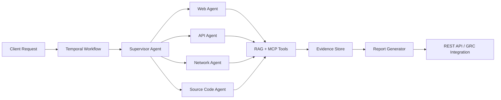

<div align="center">

# Manjunath K G

**AI/ML Trainee Engineer · Agentic AI · Offensive & Defensive Security**

Architecting multi-agent AI systems for autonomous pentesting, GRC automation, and production LLM pipelines — where AI engineering meets real-world cyber security.

[](https://manja7304.github.io/myPersonalPortfolio/)
[](https://www.linkedin.com/in/manjunathkg07)
[](mailto:manjunathkg4433@gmail.com)
[](https://leetcode.com/u/chethan7304/)
[](https://tryhackme.com/p/manja4444)
[](#certifications--achievements)

*Bengaluru, India · AI/ML Trainee Engineer @ Ampcus Cyber*

</div>

---

## About

I'm an **AI/ML Trainee Engineer at Ampcus Cyber** building production agentic platforms at the intersection of **AI engineering** and **cyber security** — autonomous pentesting SaaS, MCP-driven compliance automation, RAG evaluation pipelines, and LLM cost/quality optimization for enterprise security products.

```python
class AIEngineer:
    name = "Manjunath K G"
    role = "AI/ML Trainee Engineer @ Ampcus Cyber"
    domains = ["Agentic AI", "Autonomous Pentesting", "GRC Automation", "LLM Ops"]

    def agent_stack(self):
        return {
            "orchestration": ["Claude Agent SDK", "LiteLLM", "Temporal", "LangGraph"],
            "backend": ["FastAPI", "Next.js", "PostgreSQL", "Redis"],
            "ai_patterns": ["ReAct", "Supervisor/Router", "Plan-and-Execute", "Tool Calling"],
            "security": ["OWASP Top 10", "OWASP WSTG", "MITRE ATT&CK", "CEH v13"],
        }
```

---

## AI Engineering

Production-focused AI engineering across the full lifecycle — from agent design and orchestration to evaluation, observability, and cost control.

### Agentic Systems & Orchestration
- Designed **60+ specialized AI agents** for web, API, Android, source-code, and network security surfaces
- Built **phased parallel orchestration** (30+ agents per wave) with Temporal checkpointing, fault tolerance, and workflow recovery
- Implemented **Supervisor/Router, ReAct, Plan-and-Execute, and Reflection** patterns for reliable multi-step reasoning
- Integrated **Claude Agent SDK + LiteLLM** for model routing, fallback tiers, and provider-agnostic agent execution

### LLM Engineering & Optimization
- Reduced **token usage by 30%** via system prompt design, few-shot templates, chain-of-thought scaffolds, response caching, and model-tier selection
- Built **RAG evaluation & monitoring with RAGAS** — tracking faithfulness, relevancy, and retrieval quality across prompt/model changes
- Improved answer **faithfulness and relevancy by 30%** while preventing regressions during production updates
- Developed automated **report-generation pipelines** (6 hours → 10 minutes, ~97% reduction) for concurrent client deliverables

### RAG & Knowledge Systems
- Agentic RAG pipelines with hybrid search, embeddings, and context window management
- Vector stores: **Pinecone, Chroma, pgvector** · Knowledge graph integration for structured security context
- Short/long-term memory patterns for multi-turn agent sessions and audit trails

### MCP & Tool Integration
- Built **AWS MCP server** exposing **70+ tools** for automated cloud evidence fetching
- Extended MCP agents across **AWS, Azure, GCP, Jira, and GitHub** for GRC evidence collection
- Custom tool development, function calling, and REST/API integrations for agent-to-platform communication

### MLOps & Platform Practices
- **Docker** containerization, **Prometheus/Grafana** observability, CI/CD pipelines
- **Spec-driven development (SpecKit)** and secure-coding standards for auditable delivery
- End-to-end ownership: feature dev → test deployment → production incident response



---

## Cyber Security

Hands-on offensive and defensive security experience — from autonomous assessment platforms to compliance automation and vulnerability research.

### Offensive Security & Pentesting
- **Autonomous pentesting SaaS** covering OWASP Top 10 and **OWASP WSTG** testing categories
- Assessment turnaround reduced from **3–5 days → under 4 hours** with expanded multi-surface coverage
- Web, API, Android, source-code, and network attack surface analysis via AI-driven agents
- **CEH v13 (with AI)** certified · active **TryHackMe** practitioner

### Vulnerability Assessment & AppSec
- Built and maintained tools for **XSS, SQLi, CSRF** detection and remediation workflows
- API security assessments aligned with OWASP standards
- Automated scanning with **Burp Suite, Nessus, Nmap, Playwright**
- Custom Python security scripts for fuzzing, directory traversal, and host discovery

### Defensive Security & GRC
- **GRC evidence automation** across cloud and dev platforms (AWS, Azure, GCP, GitHub, Jira)
- Real-time **infrastructure monitoring agent** (GRACEATHON winner) — Python, FastAPI, Prometheus
- Partnered with **red-team, blue-team, and GRC** teams to translate findings into product features
- **MITRE ATT&CK**-aligned threat modeling and security control mapping

### Security Toolkit

| Category | Tools & Frameworks |
|----------|-------------------|
| **Standards** | OWASP Top 10, OWASP WSTG, MITRE ATT&CK |
| **Offensive** | Burp Suite, Nmap, Nessus, Metasploit, Playwright |
| **Cloud Security** | AWS / Azure / GCP MCP evidence agents |
| **Automation** | Custom Python scanners, XSS tooling, bug trackers |
| **Certification** | CEH v13 with AI (EC-Council) |

---

## Engineering Contributions

Shipped production features and platform improvements — presented in PR-style deliverables from active engineering work at Ampcus Cyber.

| Contribution | Domain | Impact |
|:---|:---|:---|
| `feat/autonomous-pentest-orchestrator` | Agentic AI | 60+ agents · 3–5 day assessments → **<4 hours** |
| `feat/temporal-parallel-agent-waves` | Workflow Engine | 30+ agents/wave · checkpointing & fault recovery |
| `feat/ai-report-generator` | LLM Pipeline | Report turnaround **6h → 10min (~97%)** |
| `feat/aws-mcp-evidence-server` | MCP / GRC | **70+ tools** for automated cloud evidence |
| `feat/multi-cloud-grc-agents` | Compliance | AWS · Azure · GCP · Jira · GitHub integration |
| `feat/ragas-eval-framework` | LLM Ops | **+30%** faithfulness/relevancy · regression guard |
| `perf/llm-token-optimization` | Cost Engineering | **-30%** token usage via prompts & caching |
| `feat/graceathon-observability-agent` | Blue Team | Real-time infra monitoring · Prometheus stack |

> Most production contributions live in private enterprise repos. Public work is showcased below in **Featured Projects**.

---

## Experience

### AI/ML Trainee Engineer · Ampcus Cyber
*Bengaluru · Sept 2025 – Present*

- Architected production **autonomous pentesting SaaS** on FastAPI / Next.js / PostgreSQL / Redis with public REST APIs
- Engineered **Temporal-based orchestration** for parallel AI agent execution with enterprise-grade reliability
- Built **MCP servers and GRC automation** for multi-cloud compliance evidence collection
- Drove **LLM quality, cost, and evaluation** (RAGAS) across production agent workflows
- Mentored teams on AI-tool adoption · containerized services with Docker · spec-driven secure delivery

`Claude Agent SDK` `LiteLLM` `LangGraph` `Temporal` `FastAPI` `Next.js` `MCP` `RAGAS` `Docker`

---

## Skills

<details open>
<summary><strong>AI / ML Engineering</strong></summary>

| Area | Technologies |
|------|--------------|
| **Agentic AI** | Multi-Agent Systems, LLM Orchestration, Claude Agent SDK, LangChain, LangGraph, CrewAI, Google ADK, n8n |
| **Patterns** | ReAct, Plan-and-Execute, Reflection, Supervisor/Router, Tool Calling, Human-in-the-Loop, Memory Agents |
| **RAG & Vectors** | Agentic RAG, Hybrid Search, Embeddings, Pinecone, Chroma, pgvector, Knowledge Graphs |
| **LLM Platforms** | Anthropic Claude, OpenAI, Google Gemini, Hugging Face, Transformers, LiteLLM |
| **Evaluation** | RAGAS, Prompt Engineering, Fine-Tuning, Chain-of-Thought, Response Caching |

</details>

<details open>
<summary><strong>Cyber Security</strong></summary>

| Area | Technologies |
|------|--------------|
| **Offensive** | Pentesting, OWASP Top 10, OWASP WSTG, XSS/SQLi/CSRF, API Security, Fuzzing |
| **Defensive** | GRC Automation, Cloud Compliance, MITRE ATT&CK, Incident Response, Secure Coding |
| **Tools** | Burp Suite, Nmap, Nessus, Metasploit, Playwright, Wireshark |
| **Cloud** | AWS / Azure / GCP security evidence via MCP agents |

</details>

<details>
<summary><strong>Backend, Infra & Data</strong></summary>

| Area | Technologies |
|------|--------------|
| **Backend** | FastAPI, Next.js, React, TypeScript, REST APIs |
| **Data** | PostgreSQL, Redis, MongoDB, MySQL, Pandas, NumPy, Scikit-learn |
| **Infra** | Docker, Temporal, CI/CD, Prometheus, Grafana, SpecKit |
| **Languages** | Python, TypeScript, C++, SQL |

</details>

---

## Certifications & Achievements

- **Certified Ethical Hacker (CEH v13 with AI)** — EC-Council · Credential ID: `ECC5074128936`
- **Winner — GRACEATHON (Internal Hackathon):** Real-time infrastructure monitoring & observability agent — Python, FastAPI, Prometheus
- **AI Mastery with Machine Learning** — Bluetick AI Academy
- **TryHackMe** — Active CTF & practical security labs · [Profile](https://tryhackme.com/p/manja4444)

---

## Featured Projects

### [VectorShift Pipeline Builder](https://github.com/manja7304/vectorshift-technical-assessment)
Visual AI/data pipeline builder — React drag-and-drop frontend with FastAPI backend for node-based workflow composition.

`React` `FastAPI` `JavaScript` `Python` · *Full-stack AI workflow UI*

### [Intelligent HR Candidate Profiling System](https://github.com/manja7304/Intelligent-Chat-Interface)
NLP resume parser + GPT-4 conversational interface with LinkedIn enrichment and dynamic assessment generation.

`Python` `OpenAI API` `NLP` `RAG` `SQLite` · *LLM-powered automation*

### [AI-Powered Web Scraper](https://github.com/manja7304/AI-WEB-SCRAPING)
Selenium extraction pipeline with Ollama LLM summarization, Streamlit UI, and proxy infrastructure.

`Python` `Streamlit` `Selenium` `Ollama` · *Agentic data extraction*

### [Dockerized Stock Data Pipeline](https://github.com/manja7304/stock-pipeline)
Production-style ETL with Airflow DAGs, Alpha Vantage API, PostgreSQL, and Docker Compose.

`Python` `Apache Airflow` `Docker` `PostgreSQL` · *Data engineering*

<details>
<summary><strong>Security & research repos</strong></summary>

| Project | Focus |
|---------|-------|
| [ADVANCE-XSS-SCANNER](https://github.com/manja7304/ADVANCE-XSS-SCANNER) | Automated XSS detection & payload testing |
| [HOST-DISCOVERY-WEB-APP](https://github.com/manja7304/HOST-DISCOVERY-WEB-APP) | Network recon & host enumeration |
| [BUG-TRACKER-](https://github.com/manja7304/BUG-TRACKER-) | Vulnerability tracking & triage workflow |
| [IMAGE-STEGANOGRAPHY](https://github.com/manja7304/IMAGE-STEGANOGRAPHY) | Steganography & data hiding techniques |
| [Risk Prediction — Opioid Dependency](https://github.com/manja7304/Risk-Prediction-of-Opioid-Dependency-Using-Machine-Learning) | ML classification & risk modeling |
| [Cyber-Security](https://github.com/manja7304/Cyber-Security) | Security notes, labs & practice material |

</details>

---

## GitHub Activity

<div align="center">


**24 public repos** · Python · JavaScript · TypeScript · C++ · Solidity

</div>

---

## Education

**Bachelor of Computer Applications (BCA)**  
ASC Degree College, Bangalore University · CGPA **8.3 / 10** · 2022 – 2025

---

## Open To

**Agentic AI Engineer** · **AI/ML Engineer** · **AI Security Engineer** · **Backend / Full-Stack Engineer**

Roles where multi-agent LLM systems, autonomous security tooling, and production AI pipelines are core — not side projects.

---

<div align="center">

### Let's connect

[](https://manja7304.github.io/myPersonalPortfolio/)
[](https://www.linkedin.com/in/manjunathkg07)
[](mailto:manjunathkg4433@gmail.com)
[](https://github.com/manja7304)
[](https://leetcode.com/u/chethan7304/)
[](https://tryhackme.com/p/manja4444)

*Building AI that secures · Securing AI that builds*

</div>
