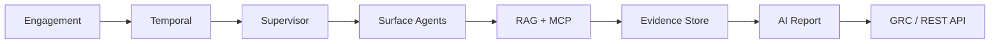
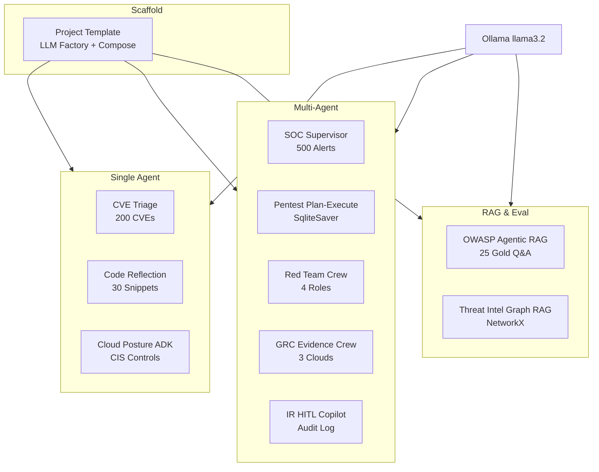

<div align="center">

<!-- Header -->


### AI/ML Trainee Engineer · Agentic AI · Offensive & Defensive Security

Building **production multi-agent platforms** for autonomous pentesting, LLM security, and GRC automation at **Ampcus Cyber**

[](https://manja7304.github.io/myPersonalPortfolio/)
[](https://manja7304.github.io/myPersonalPortfolio/blog/)
[](https://www.linkedin.com/in/manjunathkg07)
[](#-certifications)

[](mailto:manjunathkg4433@gmail.com)
[](https://tryhackme.com/p/manja4444)
[](https://leetcode.com/u/chethan7304/)

📍 Bengaluru, India · Open to **Agentic AI · AI Security · ML Engineering** roles

</div>

---

## ⚡ Impact at a Glance

<table>
<tr>
<td align="center" width="25%">
<h3>60+</h3>
<sub>Production AI Agents</sub><br>
<sub>Web · API · Android · Network</sub>
</td>
<td align="center" width="25%">
<h3>&lt;4 hrs</h3>
<sub>Pentest Turnaround</sub><br>
<sub>was 3–5 days manual</sub>
</td>
<td align="center" width="25%">
<h3>97%</h3>
<sub>Report Time Saved</sub><br>
<sub>6 hours → 10 minutes</sub>
</td>
<td align="center" width="25%">
<h3>70+</h3>
<sub>MCP Cloud Tools</sub><br>
<sub>AWS · Azure · GCP · GRC</sub>
</td>
</tr>
</table>

---

## 👨‍💻 About

**AI/ML Trainee Engineer @ Ampcus Cyber** — I architect and ship **agentic AI systems at the intersection of LLM engineering and cyber security**. My work spans autonomous pentesting SaaS, MCP-driven compliance automation, RAG evaluation pipelines, and LLM cost/quality optimization for enterprise security products.

```python
class Engineer:
    role     = "AI/ML Trainee Engineer @ Ampcus Cyber"
    focus    = ["Multi-Agent Systems", "LLM Security", "Autonomous Pentesting"]
    stack    = "Claude SDK · LiteLLM · Temporal · FastAPI · Next.js · MCP · RAGAS"
    security = "CEH v13 · OWASP Top 10 · OWASP WSTG · MITRE ATT&CK"
```

---

## 🤖 AI Engineering

<table>
<tr>
<td width="50%" valign="top">

**Agentic Systems**
- 60+ specialized agents — web, API, Android, source-code, network
- Temporal orchestration · 30+ agents/wave · checkpointing & fault recovery
- Claude Agent SDK + LiteLLM · model routing & fallback tiers
- ReAct · Supervisor/Router · Plan-and-Execute · Reflection patterns

**LLM Engineering**
- **-30%** token usage via prompt tuning, caching, model-tier selection
- RAGAS evaluation framework · **+30%** faithfulness/relevancy
- Report automation: **6h → 10min** (~97% reduction)

</td>
<td width="50%" valign="top">

**RAG & Knowledge**
- Agentic RAG · hybrid search · Pinecone · Chroma · pgvector
- Knowledge graphs · short/long-term agent memory

**MCP & Integration**
- AWS MCP server — **70+ tools** for cloud evidence fetching
- Multi-cloud GRC agents: AWS · Azure · GCP · Jira · GitHub
- Custom tool dev · function calling · REST/API integrations

**Platform**
- Docker · Prometheus/Grafana · CI/CD · SpecKit · secure coding

</td>
</tr>
</table>



---

## 🛡️ Cyber Security

<table>
<tr>
<td width="33%" valign="top">

**Offensive**
- Autonomous pentesting SaaS
- OWASP Top 10 & **WSTG** coverage
- XSS · SQLi · CSRF · API security
- Burp Suite · Nessus · Nmap · Playwright

</td>
<td width="33%" valign="top">

**Defensive & GRC**
- Multi-cloud compliance automation
- GRACEATHON winner — infra monitoring agent
- Red/blue/GRC team collaboration
- MITRE ATT&CK threat modeling

</td>
<td width="33%" valign="top">

**LLM Security**
- Prompt injection defense & AI red teaming
- Tool allowlists & least-privilege agents
- OWASP LLM Top 10 aligned controls
- Output validation before side effects

</td>
</tr>
</table>

---

## 🚀 Shipped Features

Production deliverables from enterprise AI security platform engineering:

| Feature | Stack | Impact |
|:--------|:------|:-------|
| Autonomous pentest orchestrator | Claude SDK · Temporal · LiteLLM | 60+ agents · **3–5 days → <4h** |
| Parallel agent wave engine | Temporal · FastAPI | 30+ agents/wave · fault recovery |
| AI report generator | LLM pipeline · RAG | **6h → 10min** (~97%) |
| AWS MCP evidence server | MCP · Python | **70+ cloud tools** |
| Multi-cloud GRC agents | MCP · AWS/Azure/GCP | Jira · GitHub integration |
| RAGAS eval framework | RAGAS · MLOps | **+30%** quality · regression guard |
| LLM cost optimizer | LiteLLM · caching | **-30%** token spend |
| Observability agent | FastAPI · Prometheus | GRACEATHON 🏆 winner |

> 🔒 Most production work lives in private enterprise repos · Public projects & blog below

---

## 🛠️ Tech Stack

**AI / Agents**


**Backend & Infra**


**Security**


---

## 💼 Experience

**AI/ML Trainee Engineer** · Ampcus Cyber · *Sept 2025 – Present · Bengaluru*

Architecting production **autonomous pentesting SaaS** — 60+ AI agents on FastAPI / Next.js / PostgreSQL / Redis with Temporal workflows, MCP servers, and public REST APIs. End-to-end ownership from feature development to production incident response.

`Claude Agent SDK` `LiteLLM` `LangGraph` `Temporal` `MCP` `RAGAS` `FastAPI` `Next.js` `Docker`

---

## 📂 Projects

### 🛡️ Cyber AI Portfolio

**11 production-style security AI repos** — each implements a distinct agent pattern (LangGraph, LangChain, CrewAI, Google ADK) with synthetic demo data at scale (200 CVEs, 500 SIEM alerts, 30 code snippets), Docker one-command quickstart, CI, and interviewer-ready READMEs with architecture diagrams, eval metrics, and curl examples.

Built while architecting autonomous pentesting SaaS at **Ampcus Cyber** — patterns directly applicable to production SOC, GRC, and AppSec workflows.



| # | Project | Framework | Pattern | Scale | Domain | Repo |
|:-:|:--------|:----------|:--------|:------|:-------|:-----|
| 0 | Cyber AI Project Template | FastAPI + LangChain | Shared Scaffold | 12 tests | Portfolio foundation | [cyber-ai-project-template](https://github.com/manja7304/cyber-ai-project-template) |
| 1 | CVE Triage Agent | LangGraph | Tool Pipeline + Auditable Trace | 200 CVEs | CVE prioritization & ticketing | [cyber-cve-triage-react](https://github.com/manja7304/cyber-cve-triage-react) |
| 2 | SOC Analyst Supervisor Swarm | LangGraph | Supervisor / Keyword Router | 500 alerts | SIEM alert investigation | [soc-analyst-supervisor-swarm](https://github.com/manja7304/soc-analyst-supervisor-swarm) |
| 3 | Pentest Plan-Execute Orchestrator | LangGraph | Plan-and-Execute + SqliteSaver | 4 waves | Assessment workflows | [pentest-plan-execute-orchestrator](https://github.com/manja7304/pentest-plan-execute-orchestrator) |
| 4 | OWASP Agentic RAG Assistant | LangChain | Agentic RAG + Self-Correction | 25 eval Q&A | OWASP/WSTG policy Q&A | [owasp-agentic-rag-assistant](https://github.com/manja7304/owasp-agentic-rag-assistant) |
| 5 | Secure Code Reflection Reviewer | LangChain | Reflection / Self-Critique | 30 snippets | SAST-style code review | [secure-code-reflection-reviewer](https://github.com/manja7304/secure-code-reflection-reviewer) |
| 6 | Red Team Strike Crew | CrewAI | 4-Role Sequential Crew | 1 target profile | Recon → advisory report | [redteam-strike-crew](https://github.com/manja7304/redteam-strike-crew) |
| 7 | GRC Evidence Collection Crew | CrewAI | 3-Agent Compliance Crew | 3 cloud fixtures | Multi-cloud audit evidence | [grc-evidence-collection-crew](https://github.com/manja7304/grc-evidence-collection-crew) |
| 8 | Cloud Posture ADK Agent | Google ADK | ADK-style Tool Calling | 2 CIS controls | CSPM misconfiguration detection | [cloud-posture-adk-agent](https://github.com/manja7304/cloud-posture-adk-agent) |
| 9 | Threat Intel Graph RAG | NetworkX + LangChain | Graph RAG + Hybrid Retrieval | 3-node graph | Threat intel correlation | [threat-intel-graph-rag](https://github.com/manja7304/threat-intel-graph-rag) |
| 10 | Incident Response HITL Copilot | LangGraph | Human-in-the-Loop + Audit Log | 2 proposed actions | IR playbook execution | [incident-response-hitl-copilot](https://github.com/manja7304/incident-response-hitl-copilot) |

> Every repo: `docker compose up` → `curl POST /api/v1/agent/run` · synthetic data only · full architecture diagrams & eval metrics in README

---

### 🤖 AI / ML Engineering

| Project | Description | Link |
|:--------|:------------|:-----|
| VectorShift Pipeline Builder | Visual AI/data pipeline builder · React + FastAPI | [Repo](https://github.com/manja7304/vectorshift-technical-assessment) |
| Intelligent HR Profiling | NLP resume parser + GPT-4 conversational RAG interface | [Repo](https://github.com/manja7304/Intelligent-Chat-Interface) |
| AI Web Scraper | Selenium + Ollama LLM summarization · Streamlit UI | [Repo](https://github.com/manja7304/AI-WEB-SCRAPING) |
| Stock Data Pipeline | Airflow ETL · Alpha Vantage · Docker · PostgreSQL | [Repo](https://github.com/manja7304/stock-pipeline) |
| Opioid Risk Prediction | ML classification & risk modeling project | [Repo](https://github.com/manja7304/Risk-Prediction-of-Opioid-Dependency-Using-Machine-Learning) |
| Python Mini Projects | Collection of Python automation & ML scripts | [Repo](https://github.com/manja7304/Python-Mini-Projects) |

### 🛡️ Cyber Security Tools

| Project | Description | Link |
|:--------|:------------|:-----|
| Advance XSS Scanner | Automated XSS detection & payload testing | [Repo](https://github.com/manja7304/ADVANCE-XSS-SCANNER) |
| Host Discovery Web App | Network recon & host enumeration utility | [Repo](https://github.com/manja7304/HOST-DISCOVERY-WEB-APP) |
| Bug Tracker | Vulnerability tracking & triage workflow | [Repo](https://github.com/manja7304/BUG-TRACKER-) |
| Image Steganography | Steganography & data hiding techniques | [Repo](https://github.com/manja7304/IMAGE-STEGANOGRAPHY) |
| UI & API Testing Automation | Automated UI/API test assignment suite | [Repo](https://github.com/manja7304/Automation-Assignment---UI---API-Testing) |

### 🌐 Web & Portfolio

| Project | Description | Link |
|:--------|:------------|:-----|
| Personal Portfolio (Live) | AI/Security portfolio + 30-article blog | [Live](https://manja7304.github.io/myPersonalPortfolio/) · [Repo](https://github.com/manja7304/myPersonalPortfolio) |
| Personal Portfolio v1 | Earlier portfolio iteration | [Repo](https://github.com/manja7304/Personal-Portfolio) |
| GitHub Profile | Profile README & config | [Repo](https://github.com/manja7304/manja7304) |

### 💻 Learning & Practice

| Project | Description | Link |
|:--------|:------------|:-----|
| C++ Practice | Competitive programming & DSA practice | [Repo](https://github.com/manja7304/Practise) |

---

## 📝 Writing & Blog — [30 Articles](https://manja7304.github.io/myPersonalPortfolio/blog/)

Technical writing on **agentic AI, LLM security, RAG, MCP, and offensive/defensive security**.

<details open>
<summary><strong>🛡️ LLM Security & AppSec (12 articles)</strong></summary>

| # | Article | Topic |
|:-:|:--------|:------|
| 1 | [7 LLM Security Strategies](https://manja7304.github.io/myPersonalPortfolio/blog/llm-security-strategies.html) | Production defense-in-depth |
| 2 | [OWASP LLM Top 10 in Production](https://manja7304.github.io/myPersonalPortfolio/blog/owasp-llm-top-10-production.html) | Risk → control mapping |
| 3 | [Prompt Injection & AI Red Teaming](https://manja7304.github.io/myPersonalPortfolio/blog/prompt-injection-defense.html) | Attack taxonomy & defenses |
| 4 | [Secure Prompt Engineering](https://manja7304.github.io/myPersonalPortfolio/blog/secure-prompt-engineering.html) | Enterprise prompt design |
| 5 | [Autonomous Pentesting with AI Agents](https://manja7304.github.io/myPersonalPortfolio/blog/autonomous-pentesting-ai-agents.html) | Evidence-first pentest SaaS |
| 6 | [OWASP API Security for AI Platforms](https://manja7304.github.io/myPersonalPortfolio/blog/owasp-api-security-agents.html) | Securing agent REST APIs |
| 7 | [Securing MCP Servers](https://manja7304.github.io/myPersonalPortfolio/blog/mcp-security-best-practices.html) | Tool access control |
| 8 | [Cloud GRC Automation with MCP](https://manja7304.github.io/myPersonalPortfolio/blog/cloud-grc-automation.html) | Multi-cloud compliance |
| 9 | [SQL Injection Automation](https://manja7304.github.io/myPersonalPortfolio/blog/sql-injection-automation.html) | Detection & remediation |
| 10 | [XSS Defense Deep Dive](https://manja7304.github.io/myPersonalPortfolio/blog/xss-defense-deep-dive.html) | Scanner design & prevention |
| 11 | [API Security Testing Guide](https://manja7304.github.io/myPersonalPortfolio/blog/api-security-testing-guide.html) | Auth bypass & fuzzing |
| 12 | [MITRE ATT&CK for AI Systems](https://manja7304.github.io/myPersonalPortfolio/blog/mitre-attack-ai-mapping.html) | Threat modeling AI platforms |

</details>

<details open>
<summary><strong>🤖 Agentic AI & LLM Engineering (10 articles)</strong></summary>

| # | Article | Topic |
|:-:|:--------|:------|
| 13 | [Orchestrating 60+ AI Agents](https://manja7304.github.io/myPersonalPortfolio/blog/multi-agent-orchestration.html) | Supervisor · parallel waves |
| 14 | [Temporal Workflows for AI Agents](https://manja7304.github.io/myPersonalPortfolio/blog/temporal-ai-workflows.html) | Durable agent pipelines |
| 15 | [LangGraph Agent Patterns](https://manja7304.github.io/myPersonalPortfolio/blog/langgraph-agent-patterns.html) | ReAct · Plan-and-Execute |
| 16 | [Agent Memory Systems](https://manja7304.github.io/myPersonalPortfolio/blog/agent-memory-systems.html) | Short & long-term memory |
| 17 | [Function Calling Tool Design](https://manja7304.github.io/myPersonalPortfolio/blog/function-calling-tool-design.html) | Schema & error handling |
| 18 | [FastAPI LLM Backend Patterns](https://manja7304.github.io/myPersonalPortfolio/blog/fastapi-llm-backend-patterns.html) | Streaming · async · rate limits |
| 19 | [Human-in-the-Loop Agents](https://manja7304.github.io/myPersonalPortfolio/blog/human-in-the-loop-agents.html) | Approval gates & review queues |
| 20 | [LLM Cost Optimization (-30%)](https://manja7304.github.io/myPersonalPortfolio/blog/llm-cost-optimization.html) | Model-tier routing · caching |
| 21 | [Docker for AI Production](https://manja7304.github.io/myPersonalPortfolio/blog/docker-ai-production.html) | Containerization best practices |
| 22 | [Prometheus AI Observability](https://manja7304.github.io/myPersonalPortfolio/blog/prometheus-ai-observability.html) | Metrics & alerting for agents |

</details>

<details open>
<summary><strong>📊 RAG, MLOps & Offensive Recon (8 articles)</strong></summary>

| # | Article | Topic |
|:-:|:--------|:------|
| 23 | [RAG Evaluation with RAGAS](https://manja7304.github.io/myPersonalPortfolio/blog/rag-evaluation-ragas.html) | Faithfulness · regression gates |
| 24 | [Hybrid Search for Agentic RAG](https://manja7304.github.io/myPersonalPortfolio/blog/hybrid-search-agentic-rag.html) | Vectors + BM25 |
| 25 | [Fine-Tuning vs RAG](https://manja7304.github.io/myPersonalPortfolio/blog/fine-tuning-vs-rag.html) | When to use which |
| 26 | [Vector DB Selection Guide](https://manja7304.github.io/myPersonalPortfolio/blog/vector-db-selection-rag.html) | Pinecone · Chroma · pgvector |
| 27 | [Embedding Models Comparison](https://manja7304.github.io/myPersonalPortfolio/blog/embedding-models-comparison.html) | Domain-specific retrieval |
| 28 | [Network Recon with Nmap](https://manja7304.github.io/myPersonalPortfolio/blog/network-recon-nmap.html) | Scan types & automation |
| 29 | [Burp Suite Automation](https://manja7304.github.io/myPersonalPortfolio/blog/burp-suite-for-bug-hunters.html) | Extensions & CI integration |
| 30 | [Spec-Driven AI Development](https://manja7304.github.io/myPersonalPortfolio/blog/spec-driven-ai-development.html) | SpecKit for auditable delivery |

</details>

**→ [Browse all 30 articles](https://manja7304.github.io/myPersonalPortfolio/blog/)**

---

## 🏆 Certifications

- 🛡️ **CEH v13 with AI** — EC-Council · `ECC5074128936`
- 🏆 **GRACEATHON Winner** — Real-time infra monitoring agent (Python, FastAPI, Prometheus)
- 🤖 **AI Mastery with ML** — Bluetick AI Academy
- 🎯 **TryHackMe** — Active offensive security labs

---

## 📊 GitHub

<div align="center">


</div>

---

## 🎓 Education

**BCA** · ASC Degree College, Bangalore University · CGPA **8.3/10** · 2022 – 2025

---

## 🤝 Open To

`Agentic AI Engineer` · `AI/ML Engineer` · `AI Security Engineer` · `LLM Engineer` · `Backend Engineer`

Roles where **multi-agent systems**, **LLM security**, and **production AI pipelines** are the core product — not experiments.

---

<div align="center">

**Building AI that secures · Securing AI that builds**

[](https://manja7304.github.io/myPersonalPortfolio/)
[](https://manja7304.github.io/myPersonalPortfolio/blog/)
[](https://www.linkedin.com/in/manjunathkg07)
[](mailto:manjunathkg4433@gmail.com)

</div>
