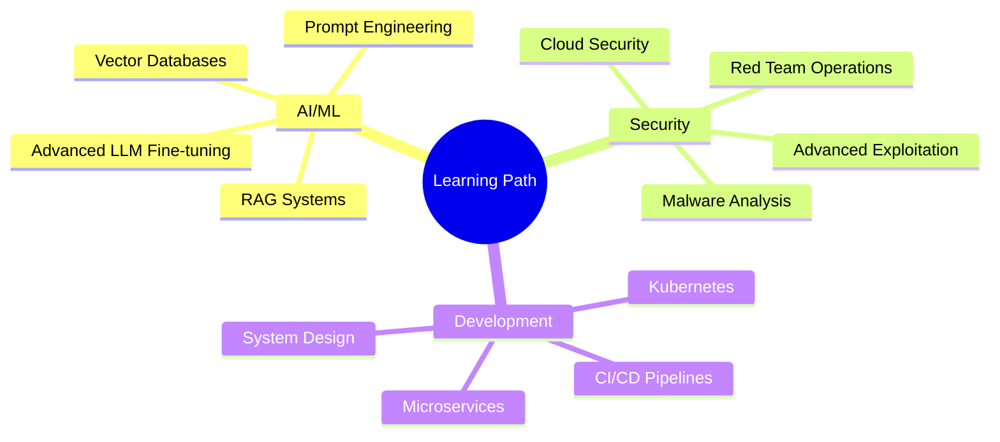

<div align="center">

#  Hey there, I'm Manjunath K G!


### *Building intelligent systems that don't just work—they think, adapt, and secure themselves.* 🚀

[](https://github.com/manja7304/manja7304)
[](https://www.linkedin.com/in/manjunathkg07/)
[](mailto:manjunathkg4433@gmail.com)


</div>

##  What I'm All About

```python
class Manjunath:
    def __init__(self):
        self.role = "AI/ML Analyst Intern @ Ampcus Cyber"
        self.location = "Bengaluru, India 🇮🇳"
        self.education = "BCA Graduate | CGPA: 8.32/10"
        self.current_focus = [
            "🔐 AI-driven Security Compliance",
            "🤖 LLM Fine-tuning & Integration",
            "🛡️ Security Standards & Practices",
            "⚡ Intelligent Automation"
        ]
        self.philosophy = "Code with purpose. Secure by design. Automate everything."
    
    def say_hi(self):
        print("Thanks for dropping by! Let's build something amazing together 🚀")
    
    def get_skills(self):
        return {
            "languages": ["Python", "C++"],
            "ai_ml": ["OpenAI", "LLMs", "NLP", "RAG"],
            "security": ["OWASP", "Burp Suite", "Metasploit", "Nessus"],
            "devops": ["Docker", "Airflow", "PostgreSQL", "Git"]
        }

me = Manjunath()
me.say_hi()
```


## 🔥 Current Adventures

<table>
<tr>
<td width="50%">

### 🎯 @ Ampcus Cyber
- 🔐 Researching AI solutions for security compliance
- 🤖 Building context-aware intelligent systems
- 🛡️ ML-powered threat detection
- ⚡ LLM security assistants

</td>
<td width="50%">

### 💡 Personal Goals
- 🌟 Contributing to open-source AI projects
- 📚 Mastering advanced ML architectures
- 🔬 Exploring cutting-edge security research
- 🚀 Building products that matter

</td>
</tr>
</table>


## 💼 Experience Journey

<details open>
<summary><b>🤖 AI/ML Analyst Intern | Ampcus Cyber</b></summary>
<br>

**📅 Sept 2025 - Present** | Bengaluru, India

```yaml
achievements:
  - 🔐 Researching AI-driven security compliance automation
  - 📊 Built real-time server monitoring agents with intelligent alerting
  - 🤖 Fine-tuned OpenAI models for customer-specific security queries
  - 📝 Automated compliance documentation workflows
  
impact: "Reduced manual compliance checks by implementing intelligent automation"
```

</details>

<details>
<summary><b>🛡️ Cyber Security Intern | Hacker School</b></summary>
<br>

**📅 Jan 2025 - Mar 2025** | Bengaluru, India

```yaml
achievements:
  - 🔍 Identified & remediated SQLi, XSS vulnerabilities
  - 🎯 Automated security scans with Nessus
  - 🔨 Conducted fuzzing & directory traversal attacks
  - ✅ API security testing against OWASP Top 10
  
impact: "Enhanced security posture through comprehensive pentesting"
```

</details>


## 🛠️ Tech Arsenal

<div align="center">

### Languages & Core


### AI/ML & Data Engineering


### Security Arsenal 🔒


### DevOps & Tools


</div>


## 🎯 Featured Projects

<div align="center">

### 🤖 Intelligent HR Candidate Profiling System
[](https://github.com/manja7304/Intelligent-Chat-Interface)

**AI-powered recruitment automation platform**

</div>

<table>
<tr>
<td width="60%">

**🌟 Key Features:**
- 📄 NLP-based resume parsing from multiple formats
- 🔗 Automated LinkedIn data extraction & profile enrichment
- 💬 Conversational AI interface for intelligent queries
- 📊 Dynamic assessment form generation
- ⚡ Reduced manual screening time by 70%

</td>
<td width="40%">

**🛠️ Tech Stack:**
```yaml
Backend: Python
AI/ML: OpenAI API, NLP
Tools: BeautifulSoup
Database: SQLite
```

</td>
</tr>
</table>

<div align="center">

---

### 🕷️ AI-Powered Web Scraper
[](https://github.com/manja7304/AI-WEB-SCRAPING)

**Smart data extraction with LLM enhancement**

</div>

<table>
<tr>
<td width="60%">

**🌟 Key Features:**
- 🌐 Selenium-based dynamic content scraping
- 🤖 Ollama LLM integration for content summarization
- 🎨 Interactive Streamlit UI
- 🛡️ BrightData proxy infrastructure
- 🔧 Modular architecture with error handling

</td>
<td width="40%">

**🛠️ Tech Stack:**
```yaml
Framework: Streamlit
Scraping: Selenium
AI: Ollama
Proxy: BrightData
Language: Python
```

</td>
</tr>
</table>

<div align="center">

---

### 📈 Dockerized Stock Data Pipeline
[](https://github.com/manja7304/stock-pipeline)

**Automated financial data ETL system**

</div>

<table>
<tr>
<td width="60%">

**🌟 Key Features:**
- 🔄 Apache Airflow orchestration
- 📊 Alpha Vantage API integration
- 🗄️ PostgreSQL with optimized schema
- 🐳 Fully containerized with Docker
- ⏰ Scheduled DAGs for automation

</td>
<td width="40%">

**🛠️ Tech Stack:**
```yaml
Orchestration: Airflow
Container: Docker
Database: PostgreSQL
API: Alpha Vantage
Language: Python
```

</td>
</tr>
</table>


## 📊 GitHub Analytics

<div align="center">


</div>

<div align="center">


</div>

<div align="center">


</div>


## 🎓 Continuous Learning Journey

<div align="center">



</div>


## 💡 My Philosophy

<div align="center">

> ### *"The best code is code that solves real problems.*
> ### *The best security is security that adapts.*
> ### *The best AI is AI that understands context."*

</div>

<table>
<tr>
<td width="25%" align="center">

### 🎯
**Purpose-Driven**
Every line serves a need

</td>
<td width="25%" align="center">

### 🔒
**Security First**
Foundation, not afterthought

</td>
<td width="25%" align="center">

### 🤖
**Smart Automation**
Machines for mundane, humans for creative

</td>
<td width="25%" align="center">

### 🌱
**Always Learning**
Evolution is continuous

</td>
</tr>
</table>


## 🏆 Achievements & Certifications

<div align="center">

| 🎖️ Achievement | 📅 Year | 🎯 Issuer |
|:---|:---:|:---|
| AI/ML Analyst Intern | 2025 | Ampcus Cyber |
| Cyber Security Training | 2025 | Hacker School |
| CGPA: 8.32/10 | 2025 | Bangalore University |

</div>


## 🤝 Let's Connect & Collaborate!

<div align="center">

### 🔗 Open to collaborating on:
**AI/ML Projects** • **Security Research** • **Open Source Contributions** • **Innovative Solutions**

### 💼 Seeking opportunities in:
**AI/ML Engineering** • **Security Engineering** • **Backend Development** • **Full-Stack Development**

<br>

[](https://github.com/manja7304)
[](https://www.linkedin.com/in/manjunathkg07/)
[](mailto:manjunathkg4433@gmail.com)

<br>

### ⚡ Fun Fact
*I debug code faster than I debug my life choices* 😄

### 💬 Random Dev Quote


### 🐍 Watch the Snake eat my contributions!

<picture>
  <source media="(prefers-color-scheme: dark)" srcset="https://raw.githubusercontent.com/manja7304/manja7304/output/github-contribution-grid-snake-dark.svg">
  <source media="(prefers-color-scheme: light)" srcset="https://raw.githubusercontent.com/manja7304/manja7304/output/github-contribution-grid-snake.svg">
  
</picture>

<br><br>

**💼 Open to Opportunities** • **🤝 Available for Collaboration** • **🚀 Let's Build the Future Together!**

<br>


</div>
